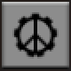

# Planetary Peace

  
*Peaceful Mode Active – enemy units will not attack unless provoked*

  
*Peaceful Mode Inactive – enemy units are hostile*

Factorio sets peaceful mode per surface; this mod makes that setting toggleable for each planet.

Use the shortcut (or Ctrl + P) to toggle peaceful mode on the current planet.
When the shortcut is active (yellow), enemy units are peaceful unless provoked.
When inactive (gray), enemy units are hostile.

---

## Alternate Locales
`cs`, `de`, `es`, `fr`, `ja`, `pl`, `pt-BR`, `ru`, `tr`, `uk`, `zh-CN`, `zh-TW`
