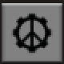

# Planetary Peace

  
*Peaceful Mode Active – enemy units will not attack unless provoked*

  
*Peaceful Mode Inactive – enemy units are hostile*

Each planet (surface) maintains its own peaceful state.

## Controls

- Shortcut button appears in the shortcut bar  
- Default keybind: Ctrl + P

---

## Alternate Locales

Available translations:  
`cs`, `de`, `es`, `fr`, `ja`, `pl`, `pt-BR`, `ru`, `tr`, `uk`, `zh-CN`, `zh-TW`
